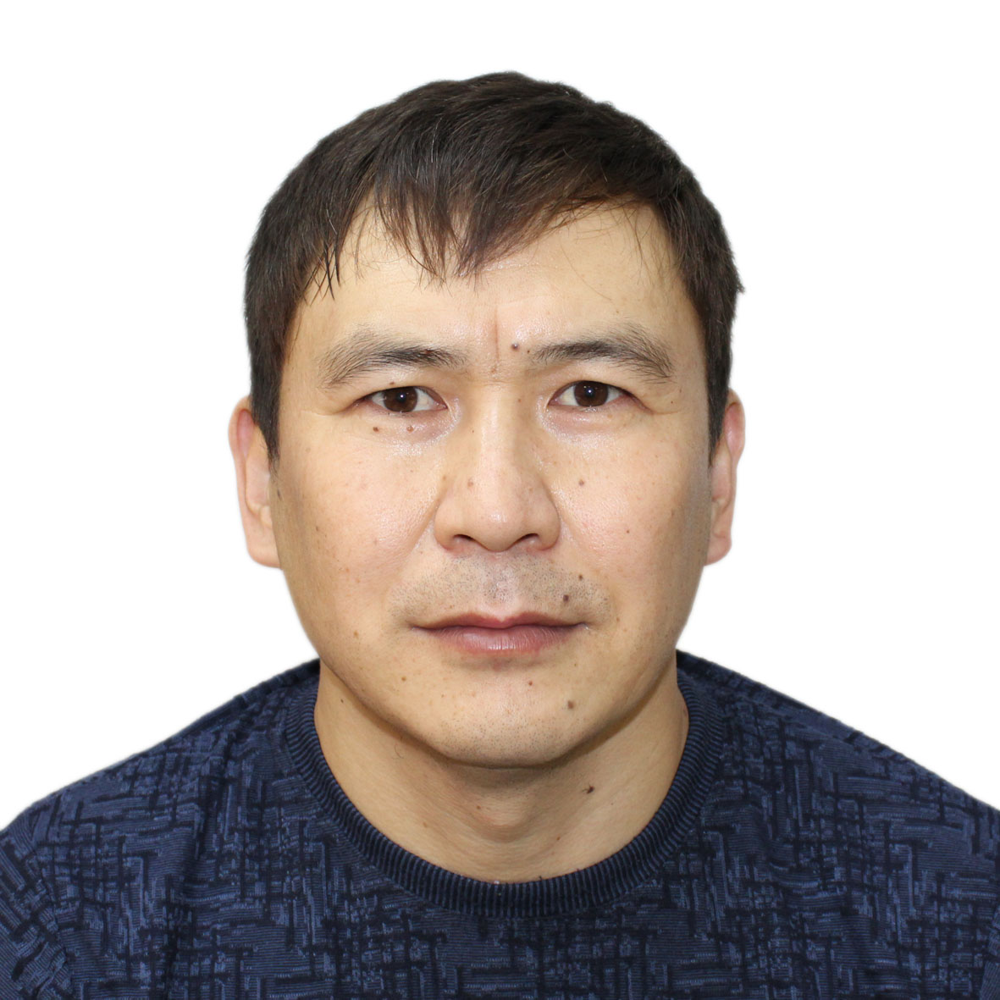

## Жеребцов Зоригто Григорьевич

Я Зоригто, мне 39 лет, после окончания Бурятского государственного университета по специальности "Востоковедение" в 2005 году, на следующий год я уехал в Японию. Жил, работал и учился там более 4 лет. Я вернулся на Родину сразу после того, как случилось большое землетрясение в марте 2011 года, с тех пор нахожусь в России. Сменил несколько работ, работал зам.руководителя цеха по производству палочек для еды, работал ведущим специалистом экономистом отдела сельского хозяйства администрации МР "Ононский район" в Забайкальском крае, затем работал помощником по электромонтажу как самозянятый. Сейчас я ИП, торгую на маркетплейсе WB.
## Ключевые навыки 
1. Водительское удостоверение категории BC  
2. JLPT N2 (Экзамен японского языка, уровень2)                                                                                                      
3. Удостоверение электромонтажника по вторичным цепям 3-го разряда                                                                                                        
4. Английский язык (Intermediate) 

